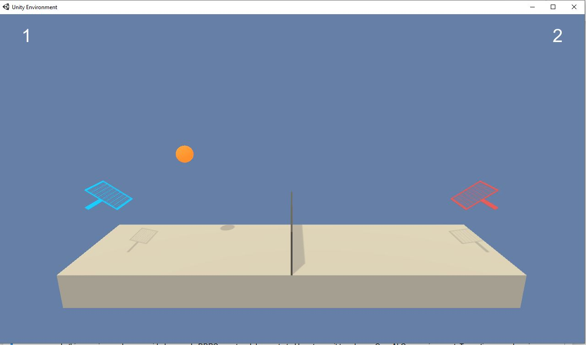

# Third Assignment: Multi-Agent RL 

## Project Details

Goal of the project is to train two agents to play a cooperative tennis match (goal of each agent is to keep the ball in play) in an UnityML environment, where the reward is +0.1 if an agent hits the ball over the net. A reward of -0.01 is given if an agent lets a ball hit the ground or hits the ball out of bounds.  
In the simulated environment, two agents that can move in a two dimensional plane (towards/away from the net and up/down movement). 
<!--   -->                                     
<!--   -->
 

At each time step, the agents perform continuous actions \vec(a)=[a1,a2] with a_i in [-1,1], corresponding to movement toward (or away from) the net, and jumping. 

The continous state space has `24` dimensions and contains position and velocity of the ball and the observing agent (racket). 8 environment variables are given at every point in time, which are then [stacked](https://github.com/Unity-Technologies/ml-agents/blob/main/docs/Learning-Environment-Design-Agents.md#stacking) for 3 time points.
The continous values of the state space are in the range [-30,30] (and should be normalized to [-1,1] before training the agents).

## Getting Started
1) Check out the [Udacity Git](https://github.com/udacity/Value-based-methods) for installing dependencies or downloading needed files. 
You will install/add a new Python environment called drlnd to your Python installation.  
    **Note**: While installing the dependencies after cloning the git repository

        git clone https://github.com/udacity/Value-based-methods.git
        cd Value-based-methods/python
        pip install .

    You might encounter the problem that PyTorch version 0.4.0 is not available. Edit the file requirements.txt and just install the most recent version (which worked fine for me). 

2) Check out the [Udacity Git](https://github.com/udacity/deep-reinforcement-learning/tree/master/p3_collab-compet) for install instruction for the [Unity-ML](https://github.com/Unity-Technologies/ml-agents) environment.  The Unit-ML environment Win (64bit) can be directly downloaded [here](https://s3-us-west-1.amazonaws.com/udacity-drlnd/P3/Tennis/Tennis_Windows_x86_64.zip).

3) It is possible to work with the Unity ML env. in [headless mode](https://github.com/Unity-Technologies/ml-agents/blob/main/docs/Learning-Environment-Executable.md#training-on-headless-server). In fact, it's quite easy and speeds up training significantly: 

         env = UnityEnvironment(file_name='C:\where_ever\Tennis_Windows_x86_64\Tennis.exe',no_graphics=True)

## Instructions
Tow subdirectories for either MADDPG or DDPG are provided in this repository. 
To run the training code in the repository start with either of the different training codes provided below. To load the weights and observe the agents performance use one of the ShowAgentPerformance scripts below (you might have to change the checkpoint loding directory..). 

## Framework
The code is written in PyTorch and Python 3.

## Training Code 
Functional, well-documented, and organized code for training the agent is provided for different implementations via Jupiter notebooks:
1. MADDPG    [./MADDPG/MADDPG_Train.ipynb](MADDPG_Train.ipynb)
2. MADDPG (reduced state space: Only single time frame)   [./MADDPG/MADDPD_Train_reduced.ipynb](MADDPD_Train_reduced.ipynb)
3. DDPG   [./DDPG/DDPG_Multi_Train_kthStep.ipynb.ipynb](DDPG_Multi_Train_kthStep.ipynb.ipynb)

## Saved Model Weights
The submission includes the saved model weights of the successful agents:
1. MADDPG    [./checkpoints/Run5_reduced_episode-6240.pt](Run5_reduced_episode-6240.pt)
2. MADDPG (reduced state space: Only single time frame)   None
3. DDPG / Run 1: 
   -  [./checkpoints/Multi_checkpoint_actor_30_20_local_2500_run1.pth](Multi_checkpoint_actor_30_20_local_2500_run1.pth)
   -  [./checkpoints/Multi_checkpoint_actor_30_20_local_2500_run1.pth](Multi_checkpoint_actor_30_20_target_2500_run1.pth)
   -  [./checkpoints/Multi_checkpoint_critic_30_20_local_2500_run1.pth](Multi_checkpoint_critic_30_20_local_2500_run1.pth)
   -  [./checkpoints/Multi_checkpoint_critic_30_20_local_2500_run1.pth](Multi_checkpoint_critic_30_20_target_2500_run1.pth)
4. DDPG / Run 3: 
   -  [./checkpoints/Multi_checkpoint_actor_30_20_local_2500_run1.pth](Multi_checkpoint_actor_30_20_local_2500_run3.pth)
   -  [./checkpoints/Multi_checkpoint_actor_30_20_local_2500_run1.pth](Multi_checkpoint_actor_30_20_target_2500_run3.pth)
   -  [./checkpoints/Multi_checkpoint_critic_30_20_local_2500_run1.pth](Multi_checkpoint_critic_30_20_local_2500_run3.pth)
   -  [./checkpoints/Multi_checkpoint_critic_30_20_local_2500_run1.pth](Multi_checkpoint_critic_30_20_target_2500_run3.pth)

## Show Agents Performance Code 
1. MADDPG    [./MADDPG/ShowAgentPerformance.ipynb](ShowAgentPerformance.ipynb)
2. MADDPG (reduced state space: Only single time frame)   None
3. DDPG   [./DDPG/ShowAgentPerformance.ipynb](ShowAgentPerformance.ipynb)

## Report
The [report](Report.md) providing a description of the implementation, more specifically the learning algorithm, along with the chosen hyperparameters and the model architectures 
for the chosen neural networks, plot of max agents reward per episode (average reward (over 100 episodes) >= 0.5), the number of episodes needed to solve the environment and 
discrete future ideas for improving the agent's performance.

## Further Reading 
- Silver et al. (2017) Mastering Chess and Shogi by Self-Play with a General Reinforcement Learning Algorithm, https://arxiv.org/abs/1712.01815  
- Silver et al. (2017) Mastering the game of Go without human knowledge  https://deepmind.com/blog/article/alphago-zero-starting-scratch  
- Lowe et al. (2017) Multi-Agent Actor-Critic for Mixed Cooperative-Competitive Environments https://proceedings.neurips.cc/paper/2017/file/68a9750337a418a86fe06c1991a1d64c-Paper.pdf  
- OpenAI Five https://openai.com/five/  
- Brener et al. (2019) Dota 2 with Large Scale Deep Reinforcement Learning, https://arxiv.org/abs/1912.06680  
- Schulman et al. (2017) Proximal Policy Optimization Algorithms https://arxiv.org/pdf/1707.06347.pdf  
- PyTorch CNN, examples https://medium.com/analytics-vidhya/implementing-cnn-in-pytorch-with-custom-dataset-and-transfer-learning-1864daac14cc , https://www.tutorialspoint.com/pytorch/pytorch_convolutional_neural_network.htm , https://blog.paperspace.com/writing-cnns-from-scratch-in-pytorch/  

