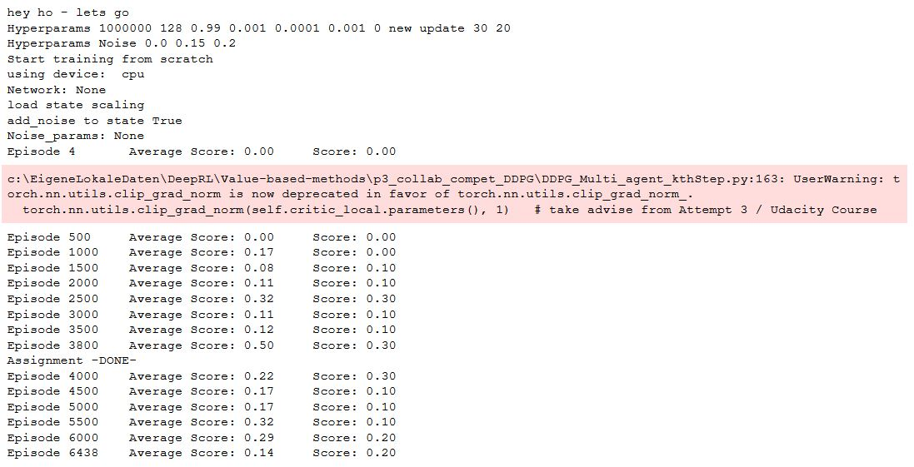

# Report
The report provides a description of the implementation to solve the multi-agent tennis project with DeepRL means. 
 

## Preprocessing
The provided state space consists of 24 variables corresponding to positions and velocities of the ball and observing agent (racket) for 3 stacked time points. 
Positions and velocities of two objects in the two dimensional plane result in 2x2x2=8 values, which are [stacked](https://github.com/Unity-Technologies/ml-agents/blob/main/docs/Learning-Environment-Design-Agents.md#stacking) 3 times to 24 values in total.  

Since the time derivatives of the ball's and agent's positions, i.e. the velocities of the two objects, are included in the observation, it is reasonable to assume that
the time stacking is not necessary for training the agents to solve the task. Hence, in a subset of experiments (called reduced environment in the following) only single time observatiosn with 8 features are used.  

The continous values of the state space are in the range [-30,30] and are normalized to [-1,1] before training the agents., by dividing each of the elements by 30 or using the scaling matrix: 
[21 30 30 30 30 30 30 30 30 30 30 23 23 23 30  8 12 14 30 30 30 30 30 30]  which is derived by sampling observations with agents performing random actions.
The matrix (int and float values) is stored in [state_scale.npz](state_scale.npz)

## First Attempt - MADDPG (full environment)
**HERE**

## Second Attempt - MADDPG (reduced environment)
**HERE**

I stopped this approach and searched the [Udacity knowledge base](https://knowledge.udacity.com/) for some support to speed up project progress...  
 
> It is true that a single agent's environment may be difficult to train,   so you may need several thousand episodes to draw robust conclusions.  
> This is why I am going to recommend the following actions:
>   - Try the second env (with 20 robotics arms) [..]  
>   - Update every X (e.g., 30) time steps the NNs.  
> https://knowledge.udacity.com/questions/772148

## Third Attempt - DDPG (full environment)
Training in the two-agent-24-states environment with the DDPG algorithm - updating the network weights at every nth step for k epochs. DDPG implementation an hyperparameter are unchanged compared to my [2nd course assignment / 3rd attempt](https://github.com/Steinheilig/DeepRL_Udacity/blob/main/policy_based/Report.md): Neural network architecture (actor (fc1: 256 - ReLU; fc2: 4, tanh); critic (fc1: 256 - ReLU; fc2 (fc1+action): 256 - ReLU; fc3: 128; fc4: 1) and hyperparameter set (batch size == 64, L2 Weight decay == 0; LR critic == 1e-3, all other parameters unchanged to this [implementation](https://github.com/udacity/deep-reinforcement-learning/tree/master/ddpg-bipedal)). 

  

**Solved the task in 2384 episodes!** 
However, the performance is not necessarily stable if the training is continuout 

  

Here, the task was **solved in 3800 episodes** (same setup, different seed of the UnityML env.), but the performance decreases afterwards.

## Learning Algorithm - DDPG 
I use the Deep Deterministic Policy Gradient (DDPG) in continous action space with fixed targets (soft update startegie), experience replay buffer and muti-agent environment to solve the assignment.  
 
 The DDPG requires two deep (or shallow and sufficently wide) neural neurworks. One named **actor**, learning a function approximation of the optimal deterministic policy \mu(s;\Theata_\mu), i.e. the best action a to take in a given states s: argmax_a Q(s,a). The other neural network is called **critic** and is used to approximate the action-value function Q for a given state s and the optimal action a determinied by policy \mu(s;\Theata_\mu), i.e. the action value function Q(s,\mu(s;\Theata_\mu));\Theta_Q). \Theta_\mu and \Theta_\Q indicate that the policy dependes on the network weights of the actor and the action-value function dependes on the network weights of the critic, respectively. 
 
 While the network uses and actor and a critic it is not directly an actor-critic (AC) approach and works more like an approximated DQN. The actor tries to predict the best action in a given state, the critic maximizes the Q values of the next state and is not used as a learned baseline (as in traditional AC approaches). 
 
 The two networks are depicted above. The optimal deterministic policy is approximated by the actor using a single fully connected (fc) hidden layer of 256. After the fc layer a ReLU activation function is applied and than its output is fc to the 4 dimensional output units. A tanh function is applied here to ensure that the action values are in the range [-1,1]. The action value function Q is approximated with 3 fc layers of 256, 256 and 128 units. Each followed by a ReLU activation function. The output of first layer is augmented with the action values determined by the policy (indicated by the red arrow in the picture above).  
The inpute space is 33 dimensional and each feature scaled to [-1,1]. The action space is 4 dimensional and continous, controlling the torque to the two joints of the robot arm. 
 
 
 The two networks (well in fact 4 networks: target and local network for each) are implemented in [Single/EveryStep](DDPG_Single_model_EveryStep.py), [Multiple/EveryStep](DDPG_Multi_model_EveryStep.py) and [Multiple/EverykthStep/nEpochs](DDPG_Multi_model_kthStep.py), respectively. They are augmented versions of the [base code](https://github.com/udacity/deep-reinforcement-learning/tree/master/ddpg-bipedal) from Udacity, namly the [LeakyReLU](https://paperswithcode.com/method/leaky-relu) activation functions are replaced by simple ReLU non-linearities.  
The DDPG agent code ([Single/EveryStep](DDPG_Single_agent_EveryStep.py), [Multiple/EveryStep](DDPG_Multi_agent_EveryStep.py) and [Multiple/EverykthStep/nEpochs](DDPG_Multi_agent_kthStep.py), respectivly) augments the provided [base code](https://github.com/udacity/deep-reinforcement-learning/tree/master/ddpg-bipedal) from Udacity. 
 The following adjustments are made: 
- interaction with single or multi-agent Unity-ML environment
- preprosessing of state values (scaling)
- augmenting the provided classes to allow hyperparameter and NN architecture changes on the fly, e.g. noise on/off
- a new parameter multiple_update_steps to update multiple times per agent.step() if positive and to only update with \epsilon=1/abs(multiple_update_steps) if negativ - alternatively (only 3rd approach) UPDATE_EVERY_NTH_STEP  and UPDATE_MANY_EPOCHS are introduced to controll k epoch updates after n steps
- gradients of the critic are clipped to prevent weight divergence torch.nn.utils.clip_grad_norm(self.critic_local.parameters(), 1) 
- gradients of the actor are clipped to prevent weight divergence torch.nn.utils.clip_grad_norm(self.actor_local.parameters(), 1) (only for 2nd approach) 
 
Implementations of fixed targets and experience replay buffer are unchanged compared to the code provided during the course. 
All learning hyperparameters are comparable or only slightly adjusted (highlighted by bold face) compared to the solution provided during the course, i.e.  
- n_episodes (int): maximum number of training episodes = 2000
- max_t (int): maximum number of timesteps per episode  = **1000-1**
- replay buffer size = int(1e6), BUFFER_SIZE
- minibatch size = **64**, BATCH_SIZE 
- discount factor, gamma = 0.99, GAMMA
- for soft update of target parameters, tau = 1e-3, TAU
- learning rate (actor) = 1e-4 (Adam optimizer), LR_ACTOR
- learning rate (critic) = **1e-3** (Adam optimizer), LR_CRITIC
- L2 weight decay (critic) = **0**, WEIGHT_DECAY
- how often to update the networks = 1, multiple_update_steps (only for 1st and 2nd approach)
- update every kth step= 30 , UPDATE_EVERY_NTH_STEP (only for 3rd approach)
- update how many epochs = 20 , UPDATE_MANY_EPOCHS  (only for 3rd approach)

## Learning Algorithm - MADDPG
**here**
 
## Different Implementations
Five different approaches are tested and compared:
1. DDPG - single agents / every step update   [DDPG_Single_Train_EveryStep.ipynb](DDPG_Single_Train_EveryStep.ipynb)
2. DDPG - multi agents / every step update   [DDPG_Multi_Train_EveryStep.ipynb](DDPG_Multi_Train_EveryStep.ipynb)
3. DDPG - multi agents / every nth step update of k epochs   [DDPG_Multi_Train_kthStep.ipynb](DDPG_Multi_Train_kthStep.ipynb)
4. PPO   [PPO_Train.ipynb](PPO_Single_Train.ipynb)

Functional, well-documented, and organized code for training the agent is provided for the different implementations via Jupyter notebooks.
   
## Plot of Rewards
3rd attempt needed 2384 episodes   
  
All other attempts did not reach the goal in the given training time (see above). 
The agent can be tested using [ShowAgentPerformance.ipynb](ShowAgentPerformance .ipynb)
 
## Ideas for Future Work
To further improving the agent's performance: 
- move to more stable GPU environment, with multiple GPUs to train in paralle with different hyperparameters and networks
- Setup Unity ML env. in [headless mode](https://github.com/Unity-Technologies/ml-agents/blob/main/docs/Learning-Environment-Executable.md#training-on-headless-server)
- tune hyperparameters
- optimze network architectures
- DDPG: add prioritized replay buffer 
- DDPG: add noise to the states after drawing samples from of the replay buffer (instead or additional to the noise added to the estimated best action). This might stabalize the NN function approximation (by learning that similar initial states - actions result in similar rewards - next states)
- DDPG: Ornsetein-Uhlenbeck noise was added to the action space. It has been [shown](https://openai.com/blog/better-exploration-with-parameter-noise/) that adding noise to the parameters of the neural network policy can improve performance. 
- try other policy gradient method like an actor-critic (AC) method, or soft actor-critic (SAC) algorithm. Where QR-SAC PPO was [recently used](https://www.nature.com/articles/s41586-021-04357-7) to train a reinforcment agent to outracing champion Gran Turismo drivers in Sony's PlayStation game Gran Turismo. 
