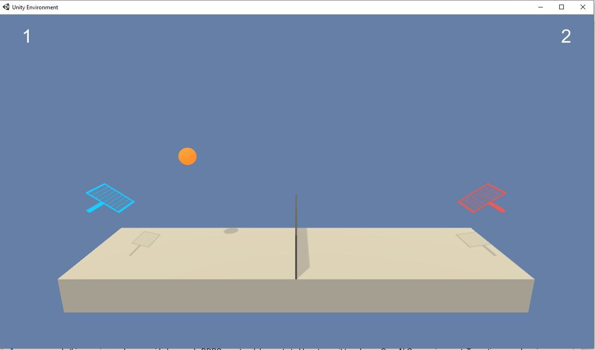
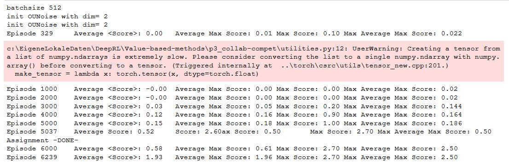
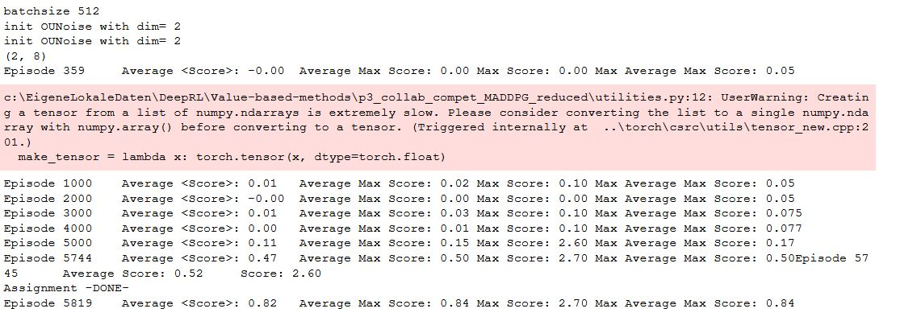
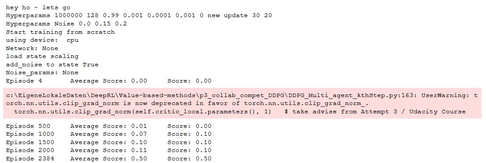
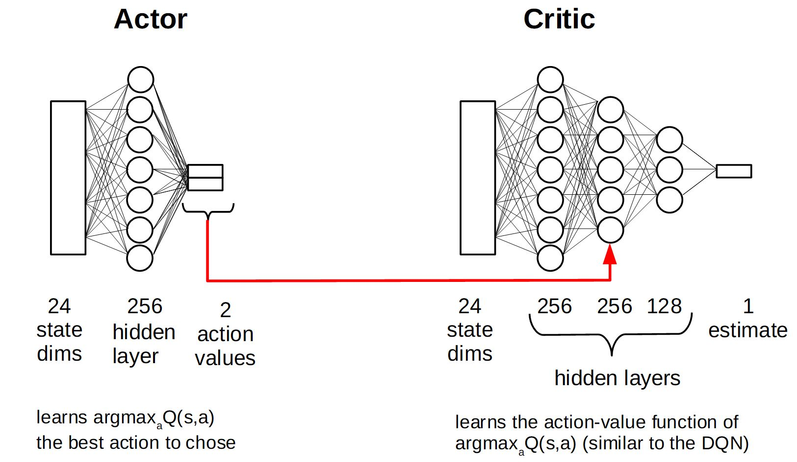
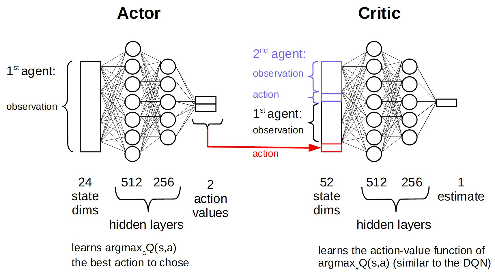
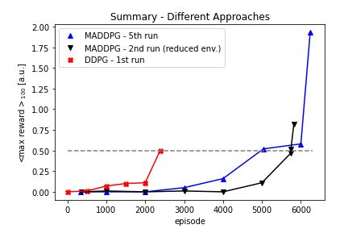

# Report
The report provides a description of the implementation to solve the multi-agent tennis project with DeepRL means.  

 

## Preprocessing
The provided state space consists of 24 variables corresponding to positions and velocities of the ball and observing agent (racket) for 3 stacked time points. 
Positions and velocities of two objects in the two dimensional plane result in 2x2x2=8 values, which are [stacked](https://github.com/Unity-Technologies/ml-agents/blob/main/docs/Learning-Environment-Design-Agents.md#stacking) 3 times to 24 values in total.  

Since the time derivatives of the ball's and agent's positions, i.e. the velocities of the two objects, are included in the observation, it is reasonable to assume that
the time stacking is not necessary for training the agents to solve the task. Hence, in a subset of experiments (called reduced environment in the following) only single time observations with 8 features are used.  

The continous values of the state space are in the range [-30,30] and are normalized to [-1,1] before training the agents., by dividing each of the elements by 30 or using the scaling matrix: 
[21 30 30 30 30 30 30 30 30 30 30 23 23 23 30  8 12 14 30 30 30 30 30 30]  which is derived by sampling observations with agents performing random actions.
The matrix (int and float values) is stored in [state_scale.npz](state_scale.npz)

## First Attempt - MADDPG (full environment)
Training in the two-agent-24-local-observation-states environment with the MADDPG algorithm. The network weights are updated *UPDATE_EVERY_NTH_STEP* time step, *UPDATE_MANY_EPOCHS* times for each agent (and *batchsize* many samples from the replay buffer). My Python implementation is based on the MADDPG example code provided in the Udacity course. The neural networks are adjusted to the different state and action spaces and the size of the hidden layers is significantly increased  (actor (fc1: 512 - ReLU; fc2: 256, tanh); critic (fc1: 512 - ReLU; fc2: 256 - ReLU, fc3: 2)). More details on the neural network architecture, hyperparameters and the MADDPG algorithm are given below.  

Different hyperparameter settings are tested (Max. Score = max of averaged_100 max scores):
| Run | Max. Score | Max. Episodes| Params|
--- | --- | ---| ---|
|1|0.12|20000|batchsize: 128, tau=0.1, discount_factor=0.9999, clipping=0.1, UPDATE_EVERY_NTH_STEP= 2, UPDATE_MANY_EPOCHS = 2, LR_ACTOR 1e-5, LR_CRITIC = 1e-5, noise_reduction=0.999, L2 weight decay (critic) = 1e-9|
|2|0.05|25881|batchsize: 2*128, tau=0.01, discount_factor=0.999, clipping=0.1, UPDATE_EVERY_NTH_STEP= 2, UPDATE_MANY_EPOCHS = 2, LR_ACTOR 1e-5, LR_CRITIC = 1e-5, noise_reduction=0.999, L2 weight decay (critic) = 1e-9|
|3|0.15|15841	|batchsize: 2*128, tau=0.1, discount_factor=0.999, clipping=0.1, UPDATE_EVERY_NTH_STEP= 2, UPDATE_MANY_EPOCHS = 2, LR_ACTOR 1e-5, LR_CRITIC = 1e-5, noise_reduction=0.999, L2 weight decay (critic) = 1e-9|
|4|**0.54**|10859|batchsize: 2*128, tau=0.1, discount_factor=0.999, clipping=1, UPDATE_EVERY_NTH_STEP= 30, UPDATE_MANY_EPOCHS = 20, LR_ACTOR 1e-4, LR_CRITIC = 1e-4|
|5|**2.50**|6239|batchsize: 4*128, tau=0.1, discount_factor=0.99, clipping=1, UPDATE_EVERY_NTH_STEP= 30, UPDATE_MANY_EPOCHS = 10, LR_ACTOR 5e-4, LR_CRITIC = 5e-4, noise_reduction = 0.9, L2 weight decay (critic) = 1e-9|

  

The assignment was **solved after 5037 episodes** (run 5), at which time point on average (over the last 100 episodes of the max reward value of the two agents) a score of 0.5 is achived! Note, that finally a score of 2.5 is acchived. This is the highest score possible given the Unity-ML environment version I used, since the episode is terminated after a time periode of roughly 25 consecutive plays over the net. I fact, I ranand observed the environment for 15minutes without any failure of the agent (See  [./MADDPG/ShowAgentPerformance.ipynb](ShowAgentPerformance.ipynb)). 

## Second Attempt - MADDPG (reduced environment)
After the MADDPG agent with the 24-states environment (individual for each agent) successfully solved the task, I tried to solve the problem faster with a reduced state-space. As stated above, since 3 consecutive time frames (8 states each) are stacked together but velcoity informations are present, it is reasonable to assume that the problem can be solved faster with only a single time frame information allown. Especially the input dimension to the critic network is reduced from 52 (2x24+2x2) to only 20 (2x8+2x2). 

Indeed, the agent learned to play tennis also in this setup but with the hyperparameter an NN setting used the problem was not faster solved than in the full enviornment setup.

Different hyperparameter settings are tested (Max. Score = max of averaged_100 max scores):
| Run | Max. Score | Max. Episodes| Params|
--- | --- | ---| ---|
|1|0.15|8000| batchsize: 4*128, tau=0.1, discount_factor=0.99, clipping=1, UPDATE_EVERY_NTH_STEP= 30, UPDATE_MANY_EPOCHS = 10, LR_ACTOR 5e-4, LR_CRITIC = 5e-4, noise_reduction = 0.9, L2 weight decay (critic) = 1e-9, code bug (used t-3 env obs. :o for training) |
|2|**0.84**|6000| batchsize: 4*128, tau=0.1, discount_factor=0.99, clipping=1, UPDATE_EVERY_NTH_STEP= 30, UPDATE_MANY_EPOCHS = 10, LR_ACTOR 5e-4, LR_CRITIC = 5e-4, noise_reduction = 0.9, L2 weight decay (critic) = 1e-9|
|3|0.07|9400| batchsize: 4*128, tau=0.1, discount_factor=0.99, clipping=1, UPDATE_EVERY_NTH_STEP= 30, UPDATE_MANY_EPOCHS = 10, LR_ACTOR 5e-4, LR_CRITIC = 5e-4, noise_reduction = 0.9, L2 weight decay (critic) = 1e-9, NN (actor): 128-32, NN (critic): 128-16 |
|4|**1.64**|9800| batchsize: 4*128, tau=0.1, discount_factor=0.99, clipping=1, UPDATE_EVERY_NTH_STEP= 30, UPDATE_MANY_EPOCHS = 10, LR_ACTOR 5e-4, LR_CRITIC = 5e-4, noise_reduction = 0.9, L2 weight decay (critic) = 1e-9, NN (actor): 256-128, NN (critic): 256-128 |

  
The assignment was **solved after 5745 episodes** (2nd run), at which time point on average (over the last 100 episodes of the max reward value of the two agents) a score of 0.5 is achived! Note, that a max possible score of 2.5 is achieved (the highest score possible given the Unity-ML environment version), even though not on average. 

## Third Attempt - DDPG (full environment)
It is reasonable to assume, that the tennis task can be soved with two independet but skilled tennis player trained to only hit the ball above the net without paying attention to the opponents position or movement. Hence training agentes independently, assuming all the other agent beeing part of and by this dealing with an non-stationary environment, is tested in the following using DDGP.

Training in the two-agent-24-local-observation-states environment with the DDPG algorithm - updating the network weights at every nth step for k epochs. DDPG implementation an hyperparameter are unchanged compared to my [2nd course assignment / 3rd attempt](https://github.com/Steinheilig/DeepRL_Udacity/blob/main/policy_based/Report.md): Neural network architecture (actor (fc1: 256 - ReLU; fc2: 4, tanh); critic (fc1: 256 - ReLU; fc2 (fc1+action): 256 - ReLU; fc3: 128; fc4: 1) and hyperparameter set (batch size == 64, L2 Weight decay == 0; LR critic == 1e-3, all other parameters unchanged to this [implementation](https://github.com/udacity/deep-reinforcement-learning/tree/master/ddpg-bipedal)). 

  

**Solved the task in 2384 episodes!** 
However, the performance is not necessarily stable if the training is continuout 

  

Here, the task was **solved in 3800 episodes** (same setup, different seed of the UnityML env.), but the performance decreases afterwards.

## Learning Algorithm - DDPG 
I use the Deep Deterministic Policy Gradient (DDPG) in continous action space with fixed targets (soft update startegie), experience replay buffer and muti-agent environment to solve the assignment.  
 
 The DDPG requires two deep (or shallow and sufficently wide) neural neurworks. One named **actor**, learning a function approximation of the optimal deterministic policy \mu(s;\Theata_\mu), i.e. the best action a to take in a given states s: argmax_a Q(s,a). The other neural network is called **critic** and is used to approximate the action-value function Q for a given state s and the optimal action a determinied by policy \mu(s;\Theata_\mu), i.e. the action value function Q(s,\mu(s;\Theata_\mu));\Theta_Q). \Theta_\mu and \Theta_\Q indicate that the policy dependes on the network weights of the actor and the action-value function dependes on the network weights of the critic, respectively. 
 
 While the network uses and actor and a critic it is not directly an actor-critic (AC) approach and works more like an approximated DQN. The actor tries to predict the best action in a given state, the critic maximizes the Q values of the next state and is not used as a learned baseline (as in traditional AC approaches). 
 
 The two networks are depicted below. The optimal deterministic policy is approximated by the actor using a single fully connected (fc) hidden layer of 256. After the fc layer a ReLU activation function is applied and than its output is fc to the 2 dimensional output units. A tanh function is applied here to ensure that the action values are in the range [-1,1]. The action value function Q is approximated with 3 fc layers of 256, 256 and 128 units. Each followed by a ReLU activation function. The output of first layer is augmented with the action values determined by the policy (indicated by the red arrow in the picture below).  
The inpute space is 24 dimensional, the local observation of the agent, and each feature scaled to [-1,1]. The action space is 2 dimensional and continous, controlling the agents movements along the x-axis and jumping (y-axis). 
 
 
 The two networks (well in fact 4 networks: target and local network for each) are implemented in [./DDGP/DDPG_Multi_model_kthStep.py](DDPG_Multi_model_kthStep.py). They are augmented versions of the [base code](https://github.com/udacity/deep-reinforcement-learning/tree/master/ddpg-bipedal) from Udacity, namly the [LeakyReLU](https://paperswithcode.com/method/leaky-relu) activation functions are replaced by simple ReLU non-linearities.  
The DDPG agent code ([./DDPG/DDPG_Multi_agent_kthStep.py](DDPG_Multi_agent_kthStep.py)) augments the provided [base code](https://github.com/udacity/deep-reinforcement-learning/tree/master/ddpg-bipedal) from Udacity. 
 The following adjustments are made: 
- interaction with Unity-ML environment
- preprosessing of state values (scaling)
- a new parameter multiple_update_steps to update multiple times per agent.step() if positive and to only update with \epsilon=1/abs(multiple_update_steps) if negativ - alternatively (only 3rd approach) UPDATE_EVERY_NTH_STEP  and UPDATE_MANY_EPOCHS are introduced to controll k epoch updates after n steps
- gradients of the critic are clipped to prevent weight divergence torch.nn.utils.clip_grad_norm(self.critic_local.parameters(), 1) 
- gradients of the actor are clipped to prevent weight divergence torch.nn.utils.clip_grad_norm(self.actor_local.parameters(), 1) 
 
Implementations of fixed targets and experience replay buffer are unchanged compared to the code provided during the course. 
All learning hyperparameters are comparable or only slightly adjusted (highlighted by bold face) compared to the solution provided during the course, i.e.  
- n_episodes (int): maximum number of training episodes = **10000**
- max_t (int): maximum number of timesteps per episode  = not applicable - run until agents fail ;)
- replay buffer size = int(1e6), BUFFER_SIZE
- minibatch size = **64**, BATCH_SIZE 
- discount factor, gamma = 0.99, GAMMA
- for soft update of target parameters, tau = 1e-3, TAU
- learning rate (actor) = 1e-4 (Adam optimizer), LR_ACTOR
- learning rate (critic) = **1e-3** (Adam optimizer), LR_CRITIC
- L2 weight decay (critic) = **0**, WEIGHT_DECAY
- update every kth step= 30 , UPDATE_EVERY_NTH_STEP 
- update how many epochs = 20 , UPDATE_MANY_EPOCHS  

## Learning Algorithm - MADDPG
Multi-Agent Deep Deterministic Policy Gradient (MADDPG) is an extension of the above described DDPG algorithm for collaborative and/or competitive multi-agent environments introduced by [Lowe et al. (2017)](https://proceedings.neurips.cc/paper/2017/file/68a9750337a418a86fe06c1991a1d64c-Paper.pdf). 

The basic idea is that while the actor only uses information available to the agent locally, the critic can use globally available information ("god-mode"), like all agents' observations, all agents' actions and potentially information hidden from the agents. The picture below shows the implementation for the two tennis playing agents. Each agent hast 24 locally available observation values and the actor learns the agent's best action given the local observation. To train the actor, a critic is trained with addtional global information; Here, the observation and action of the second agent. Hence, the input to the critic is 2x(24 + 2) = 52 dimensional (two times observations and two times actions, one of which is given by the actor). 
 

 The Python implementation is based on the MADDPG example code provided in the Udacity course. The neural networks are adjusted to the different state and action spaces and the size of the hidden layers is significantly increased  (actor (fc1: 512 - ReLU; fc2: 256, tanh); critic (fc1: 512 - ReLU; fc2: 256 - ReLU, fc3: 2)). 
 
 The following adjustments are made: 
- interaction with Unity-ML environment
- preprosessing of state values (scaling)
- add noise rest to ddpg model and reset noise generator after each episode
- reducing state-space (by removing stacked time information) (only 2nd attempt)
- augmenting the provided classes to allow hyperparameter and NN architecture changes on the fly, e.g. noise on/off
- a new parameters UPDATE_EVERY_NTH_STEP and UPDATE_MANY_EPOCHS - introduced to control k epoch updates after n steps
- gradients of the critic are clipped to prevent weight divergence torch.nn.utils.clip_grad_norm(self.critic_local.parameters(), .1) 
- gradients of the actor are clipped to prevent weight divergence torch.nn.utils.clip_grad_norm(self.actor_local.parameters(), .1) 
 
Implementations of fixed targets and experience replay buffer are unchanged compared to the code provided during the course. 
All learning hyperparameters are comparable or only slightly adjusted (highlighted by bold face) compared to the solution provided during the course, i.e.  
- n_episodes (int): maximum number of training episodes = **30000**
- max_t (int): maximum number of timesteps per episode  = not applicable - run until agents fail ;)
- replay buffer size = 1e6, BUFFER_SIZE
- minibatch size = **128**, **256**, BATCH_SIZE 
- discount factor, gamma = **0.999**,**0.9999** GAMMA
- for soft update of target parameters, tau = **0.1**, **0.01**, TAU
- learning rate (actor) = 1e-4, **1e-5** (Adam optimizer), LR_ACTOR
- learning rate (critic) = **1e-4**, **1e-5** (Adam optimizer), LR_CRITIC
- L2 weight decay (critic) = **0**, **1.e-9**, WEIGHT_DECAY
- update every kth step= 30 , UPDATE_EVERY_NTH_STEP 
- update how many epochs = 20 , UPDATE_MANY_EPOCHS  
- OU Noise = **4** 
- OU Noise reduction = **0.999**, **0.9**
 
## Different Implementations
Functional, well-documented, and organized code for training the agent is provided for the different implementations via Jupyter notebooks.
Three different approaches are tested and compared:
1. MADDPG    [./MADDPG/MADDPG_Train.ipynb](MADDPG_Train.ipynb)
2. MADDPG (reduced state space: Only single time frame)   [./MADDPG/MADDPD_Train_reduced.ipynb](MADDPD_Train_reduced.ipynb)
3. DDPG   [./DDPG/DDPG_Multi_Train_kthStep.ipynb.ipynb](DDPG_Multi_Train_kthStep.ipynb.ipynb)

### Saved Model Weights
The submission includes the saved model weights of the successful agents:
1. MADDPG    [./checkpoints/Run5_reduced_episode-6240.pt](Run5_reduced_episode-6240.pt)
2. MADDPG (reduced state space: Only single time frame)   None
3. DDPG / Run 1: 
   -  [./checkpoints/Multi_checkpoint_actor_30_20_local_2500_run1.pth](Multi_checkpoint_actor_30_20_local_2500_run1.pth)
   -  [./checkpoints/Multi_checkpoint_actor_30_20_local_2500_run1.pth](Multi_checkpoint_actor_30_20_target_2500_run1.pth)
   -  [./checkpoints/Multi_checkpoint_critic_30_20_local_2500_run1.pth](Multi_checkpoint_critic_30_20_local_2500_run1.pth)
   -  [./checkpoints/Multi_checkpoint_critic_30_20_local_2500_run1.pth](Multi_checkpoint_critic_30_20_target_2500_run1.pth)
4. DDPG / Run 3: 
   -  [./checkpoints/Multi_checkpoint_actor_30_20_local_2500_run1.pth](Multi_checkpoint_actor_30_20_local_2500_run3.pth)
   -  [./checkpoints/Multi_checkpoint_actor_30_20_local_2500_run1.pth](Multi_checkpoint_actor_30_20_target_2500_run3.pth)
   -  [./checkpoints/Multi_checkpoint_critic_30_20_local_2500_run1.pth](Multi_checkpoint_critic_30_20_local_2500_run3.pth)
   -  [./checkpoints/Multi_checkpoint_critic_30_20_local_2500_run1.pth](Multi_checkpoint_critic_30_20_target_2500_run3.pth)

### Show Agents Performance Code 
1. MADDPG    [./MADDPG/ShowAgentPerformance.ipynb](ShowAgentPerformance.ipynb)
2. MADDPG (reduced state space: Only single time frame)   None
3. DDPG   [./DDPG/ShowAgentPerformance.ipynb](ShowAgentPerformance.ipynb)

## Plot of Rewards
3rd attempt (individual DDPG agents) was the fasted and needed 2384 episodes to reach the target performance   
  

Here an overview over the rewards as a function of epochs during training for the fastest training runs for each of the three approches. 
 

The agent can be tested using [./DDPG/ShowAgentPerformance.ipynb](ShowAgentPerformance.ipynb).

 
## Ideas for Future Work
To further improving the agent's performance: 
- tune hyperparameters
- optimize network architectures
- pretrain single DDPG agents first, then use the pretrained actor network in a MADDPG approach
- DDPG: add prioritized replay buffer 
- DDPG: add noise to the states after drawing samples from of the replay buffer (instead or additional to the noise added to the estimated best action). This might stabalize the NN function approximation (by learning that similar initial states - actions result in similar rewards - next states)
- DDPG: Ornsetein-Uhlenbeck noise was added to the action space. It has been [shown](https://openai.com/blog/better-exploration-with-parameter-noise/) that adding noise to the parameters of the neural network policy can improve performance. 
- try other policy gradient method like an actor-critic (AC) method, or soft actor-critic (SAC) algorithm. Where QR-SAC was [recently used](https://www.nature.com/articles/s41586-021-04357-7) to train a reinforcment agent to outracing champion Gran Turismo drivers in Sony's PlayStation game Gran Turismo. 
