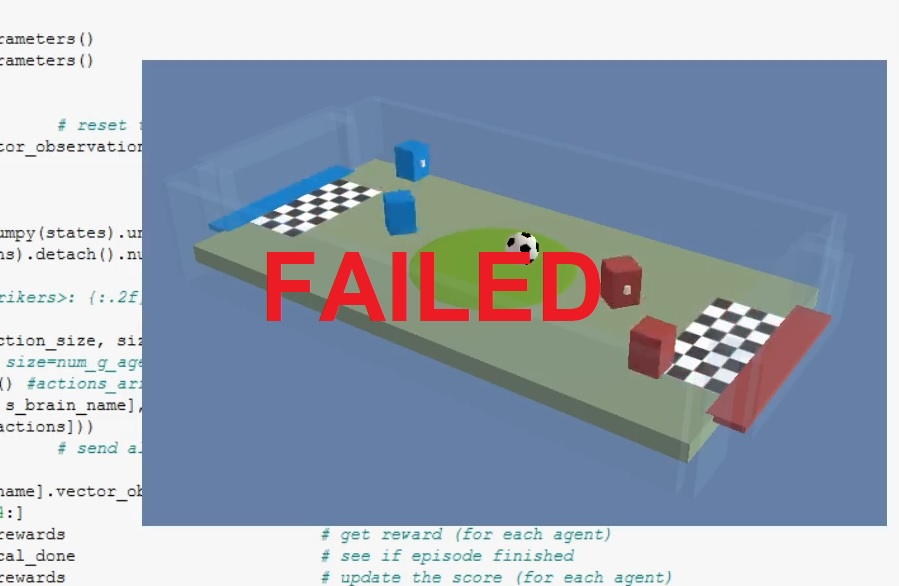

# Report
The report provides a description of the implementation to solve the multi-agent soccer project with DeepRL means.  
Two strikers (366 continous observations, 6 discret actions) and two goalies(366 continous observations, 4 discret actions) are simulated in an Unity-ML soccer environment [Win64](https://s3-us-west-1.amazonaws.com/udacity-drlnd/P3/Soccer/Soccer_Windows_x86_64.zip)/[Linux](https://s3-us-west-1.amazonaws.com/udacity-drlnd/P3/Soccer/Soccer_Linux.zip).

 

## Preprocessing
The provided observation space consists of 122 variables for 3 [stacked](https://github.com/Unity-Technologies/ml-agents/blob/main/docs/Learning-Environment-Design-Agents.md#stacking) time points to 366 values in total.  

Since the time derivatives of the ball's and agent's positions, i.e. the velocities of the objects, can be infered from two consecutive frames alone, it is reasonable to assume that the time stacking of more than two time points is not necessary for training the agents to solve the task. 
Hence, in a subset of experiments (called reduced environment in the following) only two consecutive time observations with in total 224 features are used.  

The continous values of the state space are normalized to [-1,1].

To further reduce the difficulty of the task (and to compensate fore the lack of an apropriate GPU) in a subset of experiments only either the strikers or the goalies are trained. 
By itertively, first training only a subset of (similar) agents individually and then using their actors in a follow up training of the other subset of the agents, the problem can reduced to iterative subproblems of lower complexity.
To even further reduce the initial difficulty in a subset of experiments the goalies are not defending.

## First Attempt - MADDPG (reduced environment, train only strikers, random golies)
Training in the two-times-two-agent-224-local-observation-states environment with the MADDPG algorithm. 
Only strikers are trained and the golies perform random actions.

The network weights are updated *UPDATE_EVERY_NTH_STEP* time step, *UPDATE_MANY_EPOCHS* times for each agent 
(and *batchsize* many samples from the replay buffer). My Python implementation is based on the MADDPG example code provided in the Udacity course. 
The neural networks are adjusted to the different state and action spaces and the size of the hidden layers is significantly increased 
(actor (fc1: 1024 - ReLU; fc2: 512 - ReLU, fc2: 6, softmax); critic (fc1: 1042 - ReLU; fc2 : 512 - ReLU, fc3: 1)). 

More details on the neural network architecture, hyperparameters and the MADDPG algorithm are given in the table below and in the other [report](Report.md).

Random exploration is introduced by selecting an action +/-1 of the actor's selected action with probability 2/3 (which in fact is probably a bad design choice) or an epsilon-greedy action selection with epsilon either decaying over time (over course of an episode or across episodes) or kept constant. 

Different hyperparameter settings are tested (Max. Score = max of averaged_100 max scores):
| Run | Max. Score | Max. Episodes| Params|
--- | --- | ---| ---|
|1|-0.43*|119|batchsize: 512, tau=0.1, discount_factor=0.999, clipping=1, UPDATE_EVERY_NTH_STEP= 30, UPDATE_MANY_EPOCHS = 20, LR_ACTOR 5e-4, LR_CRITIC = 5e-4, noise +/-1 p=2/3, L2 weight decay (critic) = 1e-9|
|1b|-0.37*|1449|batchsize: 128, tau=0.1, discount_factor=0.999, clipping=1, UPDATE_EVERY_NTH_STEP= 50, UPDATE_MANY_EPOCHS = 10, LR_ACTOR 5e-4, LR_CRITIC = 5e-4, noise +/-1 p=2/3, L2 weight decay (critic) = 1e-9|
|2|-0.72*|224|batchsize: 128, tau=0.1, discount_factor=0.999, clipping=1, UPDATE_EVERY_NTH_STEP= 25, UPDATE_MANY_EPOCHS = 10, LR_ACTOR 1e-3, LR_CRITIC = 1e-3, noise epsilon-greedy (start 1, decay 0.99), L2 weight decay (critic) = 1e-9|
|3|-0.93*|720|batchsize: 128, tau=0.1, discount_factor=0.999, clipping=1, UPDATE_EVERY_NTH_STEP= 30, UPDATE_MANY_EPOCHS = 20, LR_ACTOR 1e-3, LR_CRITIC = 1e-3, noise epsilon-greedy (epsilon 0.2), L2 weight decay (critic) = 1e-9|
|4| tba++ | tba |batchsize: 128, tau=0.1, discount_factor=0.995, clipping=1, UPDATE_EVERY_NTH_STEP= 30, UPDATE_MANY_EPOCHS = 20, LR_ACTOR 1e-4, LR_CRITIC = 1e-4, noise epsilon-greedy (epsilon decay across episodes, start=1; decay=0.999), L2 weight decay (critic) = 1e-9|

  (*) bug in training code, local agent's action selected based on target network weights :(  
  (++) revision of critic input: softmax action probabilites  

Until now I was not able to train the agents, probably due to some error in my MADDPG adaptation.
 

## Second Attempt - MADDPG (reduced environment, train only strikers, golies not defending)
Training in the two-times-two-agent-224-local-observation-states environment with the MADDPG algorithm. 
Only strikers are trained and the golies perform single action to force them to step away from the goal.

Different hyperparameter settings are tested (Max. Score = max of averaged_100 max scores):
| Run | Max. Score | Max. Episodes| Params|
--- | --- | ---| ---|
|1|0.06*|509|batchsize: 128, tau=0.1, discount_factor=0.999, clipping=1, UPDATE_EVERY_NTH_STEP= 30, UPDATE_MANY_EPOCHS = 20, LR_ACTOR 1e-3, LR_CRITIC = 1e-3, noise epsilon-greedy (epsilon decay across episodes, start=1; decay=0.999), L2 weight decay (critic) = 1e-9|
|2|0.06|509|batchsize: 128, tau=0.1, discount_factor=0.999, clipping=1, UPDATE_EVERY_NTH_STEP= 30, UPDATE_MANY_EPOCHS = 10, LR_ACTOR 1e-3, LR_CRITIC = 1e-3, noise epsilon-greedy (epsilon decay across episodes, start=1; decay=0.999), L2 weight decay (critic) = 1e-9|
|3|0.14+|1400|batchsize: 128, tau=0.1, discount_factor=0.999, clipping=1, UPDATE_EVERY_NTH_STEP= 30, UPDATE_MANY_EPOCHS = 20, LR_ACTOR 1e-3, LR_CRITIC = 1e-3, noise epsilon-greedy (epsilon decay across episodes, start=1; decay=0.999), L2 weight decay (critic) = 1e-9|

  (*) bug in training code, local agent's action selected based on target network weights :( 
  (+) revision of critic input: one-hot coding  

Until now I was not able to train the agents, probably due to some error in my MADDPG adaptation.
 

## Learning Algorithm - MADDPG
Multi-Agent Deep Deterministic Policy Gradient (MADDPG) is an extension of the above [described](Report.md) DDPG algorithm for collaborative and/or competitive multi-agent environments introduced by [Lowe et al. (2017)](https://proceedings.neurips.cc/paper/2017/file/68a9750337a418a86fe06c1991a1d64c-Paper.pdf). 

The basic idea is that while the actor only uses information available to the agent locally, the critic can use globally available information ("god-mode"), like all agents' observations, all agents' actions and potentially information hidden from the agents. The picture below shows the implementation for the four soccer playing agents. Each agent hast 366 locally available observation values and the actor learns the agent's best action given the local observation. To train the actor, a critic is trained with addtional global information; Here, the observation and action of the second agent. Hence, the input to the critic is 2x(366-122 + 6) = 460 dimensional (two times observations and two times actions, one of which is given by the actor). One stacked time fame is removed from the observations, just keeping the most recent two. The selected actions, which are discrete in this environment, are one-hot encoded. 
 

 The Python implementation is based on the MADDPG example code provided in the Udacity course but adapted for discrete actions, i.e. argmax action selection and one-hot encoding of selected action as input to critic. The neural networks are adjusted to the different state and action spaces and the size of the hidden layers is significantly increased (actor (fc1: 1024 - ReLU; fc2: 512, fc3: 6 -> argmax); critic (fc1: 1024 - ReLU; fc2: 512 - ReLU, fc3: 1)). 
 
 The following adjustments are made: 
- interaction with Unity-ML environment
- reducing state-space (by removing stacked time information) 
- reduce environment difficulty (by goalies not defending, only training strikers)
- augmenting the provided classes to allow hyperparameter and NN architecture changes on the fly, e.g. noise on/off
- a new parameters UPDATE_EVERY_NTH_STEP and UPDATE_MANY_EPOCHS - introduced to control k epoch updates after n steps
- gradients of the critic are clipped to prevent weight divergence torch.nn.utils.clip_grad_norm(self.critic_local.parameters(), .1) 
- gradients of the actor are clipped to prevent weight divergence torch.nn.utils.clip_grad_norm(self.actor_local.parameters(), .1) 
 
Implementations of fixed targets and experience replay buffer are unchanged compared to the code provided during the course. 
All learning hyperparameters values listed in the tables are comparable or only slightly adjusted (highlighted by bold face) compared to the solution provided during the course, i.e.  
- n_episodes (int): maximum number of training episodes = **30000**
- replay buffer size = 1e6, BUFFER_SIZE
- minibatch size = **128**, **256**, BATCH_SIZE 
- discount factor, gamma = **0.995**,**0.999**,**0.9999** GAMMA
- for soft update of target parameters, tau = **0.1**, **0.01**, TAU
- learning rate (actor) = 1e-4, **1e-5** (Adam optimizer), LR_ACTOR
- learning rate (critic) = **1e-4**, **1e-5** (Adam optimizer), LR_CRITIC
- L2 weight decay (critic) = **0**, **1.e-9**, WEIGHT_DECAY
- update every kth step= 30 , UPDATE_EVERY_NTH_STEP 
- update how many epochs = 20 , UPDATE_MANY_EPOCHS  
- Noise: **epsilon-greedy**

## Different Implementations
Functional, well-documented, and organized code for training the agent is provided for the different implementations via Jupyter notebooks.
 tba

### Saved Model Weights
The submission includes the saved model weights of the successful agents:
 tba

### Show Agents Performance Code 
 tba

## Plot of Rewards
 tba

## Ideas for Future Work
To further improving the agent's performance: 
- tune hyperparameters
- optimize network architectures
- pretrain single DDPG agents first, then use the pretrained actor network in a MADDPG approach
- DDPG: add prioritized replay buffer 
- DDPG: add noise to the states after drawing samples from of the replay buffer (instead or additional to the noise added to the estimated best action). This might stabalize the NN function approximation (by learning that similar initial states - actions result in similar rewards - next states)
- DDPG: Ornsetein-Uhlenbeck noise was added to the action space. It has been [shown](https://openai.com/blog/better-exploration-with-parameter-noise/) that adding noise to the parameters of the neural network policy can improve performance. 
- try other policy gradient method like an actor-critic (AC) method, or soft actor-critic (SAC) algorithm. Where QR-SAC was [recently used](https://www.nature.com/articles/s41586-021-04357-7) to train a reinforcment agent to outracing champion Gran Turismo drivers in Sony's PlayStation game Gran Turismo. 
