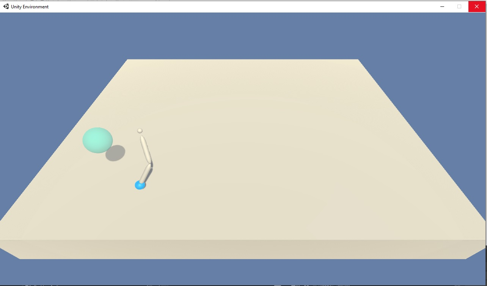

# Report
The report provides a description of the implementation to solve the 2 joint reaching robot project with DeepRL means. 
 

## Baseline Performance
A complete random agent (action values drawn from standard Normal distribution (mean=0, stdev=1) and clipped to [-1,1]) results in  
<score> 0.140 +/- 0.197  
The agent performs <done steps> 1001.0 +/- 0.0 before an epoch is terminated. Hence, tmax of continous trajectory is == 1000.

## Preprocessing
The state space consists of 33 variables corresponding to position, rotation, velocity, and angular velocities of the arm and (I guess - information not provided by Udacity) some states additionally encode sensing target position.
Most of the state features are not normalized. In fact, some feature values are in [-20,20] while others are in [-1,1] which can significantly decrease NN training performance.  
The state values are (optional) scaled by dividing with the elements of the scaling matrix:
[ 5,  5,  5,  1,  1,  1,  1, 11,  3,  4, 14, 10, 14, 10, 11, 10,  1,  1,  1,  1, 12,  9,  8, 18,
 20, 17,  8,  1,  8,  1,  1,  1,  1]

## First Attempt - DDPG (single-agent env.)
Train in the single agent environment with the DDPG algorithm. This is tidious work since a single agent learns very slow and hyperparameter and network architecture optimization (or even testing the influence of a subset) becomes nearly impossible. 
After successfully finding an architecture (actor (fc1: 256 - ReLU; fc2: 4, tanh); critic (fc1: 256 - ReLU; fc2 (fc1+action): 256 - ReLU; fc3: 128; fc4: 1) and hyperparameter set (batch size == 64, L2 Weight decay == 0; LR critic == 1e-3, all other parameters unchanged to this [implementation](https://github.com/udacity/deep-reinforcement-learning/tree/master/ddpg-bipedal))  that at least lead to some observable learning behavior 
  
I stopped this approach and searched the [Udacity knowledge base](https://knowledge.udacity.com/) for some support to speed up project progress...  
 
> It is true that a single agent's environment may be difficult to train,   so you may need several thousand episodes to draw robust conclusions.  
> This is why I am going to recommend the following actions:
>   - Try the second env (with 20 robotics arms) [..]  
>   - Update every X (e.g., 30) time steps the NNs.  
> https://knowledge.udacity.com/questions/772148
 
 
## Second Attempt - DDPG (multi-agent env.)

**TODO:...**
 use this to start: https://github.com/udacity/deep-reinforcement-learning/tree/master/ddpg-bipedal
 

## Learning Algorithm
I use the Deep Deterministic Policy Gradient (DDPG) in continous action space with fixed targets (soft update startegie), experience replay buffer and muti-agent environment to solve the assignment.  
The DDPG requires two deep (or shallow and sufficently wide) neural neurworks. One named **actor**, learning a function approximation of the optimal deterministic policy \mu(s;\Theata_\mu), i.e. the best action a to take in a given states s: argmax_a Q(s,a). The other neural network is called **critic** and is used to approximate the action-value function Q for a given state s and the optimal action a determinied by policy \mu(s;\Theata_\mu), i.e. the action value function Q(s,\mu(s;\Theata_\mu));\Theta_Q). \Theta_\mu and \Theta_\Q indicate that the policy dependes on the network weights of the actor and the action-value function dependes on the network weights of the critic, respectively.  While the network uses and actor and a critic it is not directly an actor-critic (AC) approach and works more like an approximated DQN. The actor tries to predict the best action in a given state, the critic maximizes the Q values of the next state and is not used as a learned baseline (as in traditional AC approaches). 
The two networks are depicted above. The optimal deterministic policy is approximated by the actor using a single fully connected (fc) hidden layer of 256. After the fc layer a ReLU activation function is applied and than its output is fc to the 4 dimensional output units. A tanh function is applied here to ensure that the action values are in the range [-1,1]. The action value function Q is approximated with 3 fc layers of 256, 256 and 128 units. Each followed by a ReLU activation function. The output of first layer is augmented with the action values determined by the policy (indicated by the red arrow in the picture above).  
The inpute space is 33 dimensional and each feature scaled to [-1,1]. The action space is 4 dimensional and continous, controlling the torque to the two joints of the robot arm. 
 
The two networks (well in fact 4 networks: target and local network for each) are implemented in [XXX.py](model_MLP.py). They are augmented versions of the [base code](https://github.com/udacity/deep-reinforcement-learning/tree/master/ddpg-bipedal) from Udacity, namly the LeakyReLU activation functions are replaced by ReLU non-linearities.  
The DDPG code ([XXX.py](dqn_agent.py)) augments the provided [base code](https://github.com/udacity/deep-reinforcement-learning/tree/master/ddpg-bipedal) from Udacity. 
 The following adjustments are made: 
- interaction with single or multi-agent Unity-ML environment
- preprosessing of state values (scaling)
- augmenting the provided classes to allow hyperparameter and NN architecture changes on the fly, e.g. noise on/off
- a new parameter multiple_update_steps to update multiple times per agent.step() if positive and to only update with \epsilon=1/abs(multiple_update_steps) if negativ 
- gradients of the critic are clipped to prevent weight divergence torch.nn.utils.clip_grad_norm(self.critic_local.parameters(), 1)  
- gradients of the actor are clipped to prevent weight divergence torch.nn.utils.clip_grad_norm(self.actor_local.parameters(), 1)  
 
Implementations of fixed targets and experience replay buffer are unchanged compared to the code provided during the course. 
All learning hyperparameters are compareable or only slightly adjusted (highlighted by bold face) compared to the solution provided during the course, i.e.  
- n_episodes (int): maximum number of training episodes = 2000
- max_t (int): maximum number of timesteps per episode  = **1000-1**
- replay buffer size = int(1e6), BUFFER_SIZE
- minibatch size = **64**, BATCH_SIZE 
- discount factor, gamma = 0.99, GAMMA
- for soft update of target parameters, tau = 1e-3, TAU
- learning rate (actor) = 1e-4 (Adam optimizer), LR_ACTOR
- learning rate (critic) = **1e-3** (Adam optimizer), LR_CRITIC
- L2 weight decay (critic) = **0**, WEIGHT_DECAY
- how often to update the networks, ever **XXth** step, multiple_update_steps

**Until HERE:...**
## Different Implementations
Three different approaches are tested and compared:
1. Speedrunner (reduced action space: Only forward, backward & left)   [Speedrunner1.ipynb](Speedrunner.ipynb)   Motivated by the idea that reducing turning might help to find a suitable Q-approx faster.
2. Speedrunner2 (reduced action space: Only forward & left)   [Speedrunner2.ipynb](Speedrunner2.ipynb)   Motivated by the idea that reducing turning and omiiting backward movement might help to find a suitable Q-approx faster (compare [speed running - computer game](https://www.youtube.com/watch?v=CyhI8Rghaw8).
3. Normal   [NormalRun.ipynb](NormalRun.ipynb)   Let's see how long it take to learn with all 4 actions available to the robot. In this implementation the state space was scaled, such that the last two state features are within [-1:1] (all other features remain unscaled).

Functional, well-documented, and organized code for training the agent is provided for the 3 different implementations via Jupiter notebooks.
   
## Plot of Rewards
1. Speedrunner -> 782 episodes needed   
2. Speedrunner2 -> 1001 episodes needed   
3. Normal -> 968 episodes needed   

## Ideas for Future Work
To further improving the agent's performance: 
- tune hyperparameters
- optimze Q-network architecture
- add prioritized replay buffer
- try dueling Q-networks
- read Google DeepMind's Rainbow paper and add the other remaining tweaks
