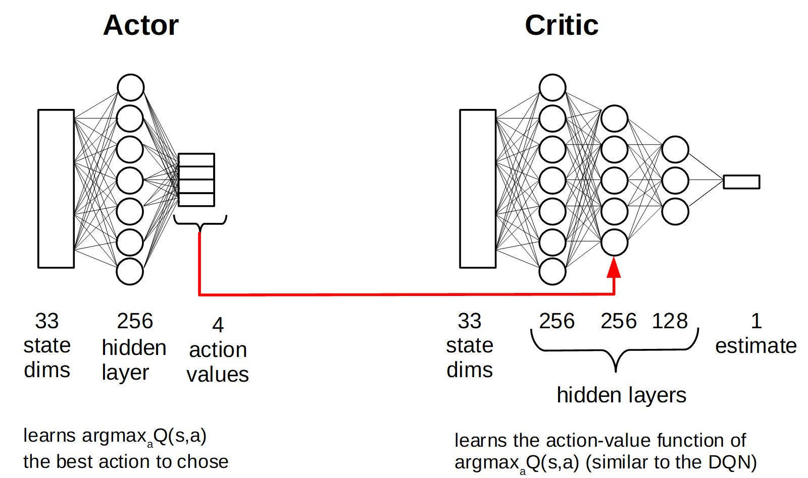
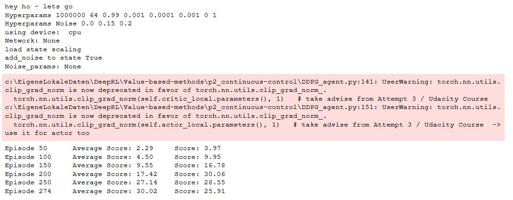

# Report
The report provides a description of the implementation to solve the 2 joint reaching robot project with DeepRL means. 
 

## Baseline Performance
A complete random agent (action values drawn from standard Normal distribution (mean=0, stdev=1) and clipped to [-1,1]) results in  
<score> 0.140 +/- 0.197  
The agent performs <done steps> 1001.0 +/- 0.0 before an epoch is terminated. Hence, tmax of continous trajectory is == 1000.

## Preprocessing
The state space consists of 33 variables corresponding to position, rotation, velocity, and angular velocities of the arm and (I guess - information not provided by Udacity) some states additionally encode sensing target position.
Most of the state features are not normalized. In fact, some feature values are in [-20,20] while others are in [-1,1] which can significantly decrease NN training performance.  
The state values are (optional) scaled by dividing with the elements of the scaling matrix: 
[ 5,  5,  5,  1,  1,  1,  1, 11,  3,  4, 14, 10, 14, 10, 11, 10,  1,  1,  1,  1, 12,  9,  8, 18,
 20, 17,  8,  1,  8,  1,  1,  1,  1] 
The matrix (int and float values) are stored in [state_scale.npz](state_scale.npz)

## First Attempt - DDPG (single-agent env.)
Train in the single agent environment with the DDPG algorithm. This is tidious work since a single agent learns very slow and hyperparameter and network architecture optimization (or even testing the influence of a subset) becomes nearly impossible. 
After successfully finding an architecture (actor (fc1: 256 - ReLU; fc2: 4, tanh); critic (fc1: 256 - ReLU; fc2 (fc1+action): 256 - ReLU; fc3: 128; fc4: 1) and hyperparameter set (batch size == 64, L2 Weight decay == 0; LR critic == 1e-3, all other parameters unchanged to this [implementation](https://github.com/udacity/deep-reinforcement-learning/tree/master/ddpg-bipedal))  that at least lead to some observable learning behavior 
  
I stopped this approach and searched the [Udacity knowledge base](https://knowledge.udacity.com/) for some support to speed up project progress...  
 
> It is true that a single agent's environment may be difficult to train,   so you may need several thousand episodes to draw robust conclusions.  
> This is why I am going to recommend the following actions:
>   - Try the second env (with 20 robotics arms) [..]  
>   - Update every X (e.g., 30) time steps the NNs.  
> https://knowledge.udacity.com/questions/772148
 
## Second Attempt - DDPG (multi-agent env. / every step update)
Train in the multi-agent (20) environment with the DDPG algorithm - updating the newtork weights at each time step. 
This is working more smoothly, each epoch the average score keeps increasing. Still the time spend traing the agent is considerable long.
Hyperparameter and network architecture optimization (or even testing the influence of a subset) is still difficult and hyperparameter and NN architectures are kept constant compared to the first attempt (described in detail below) except, that gradient clipping was introduced on both actor and critic gradient updates.  
  
The **agent learned to successfully solve the task**. It took around 36h hours on my local (CPU) machine to train until the >= 30 rewards on average (over 100 succeeeding episodes and averaged over all 20 agents) was achived.  
 
## Third Attempt - DDPG (multi-agent env. / every nth step update of k epochs)
Train in the multi-agent (20) environment with the DDPG algorithm - updating the newtork weights at every nth step for k epochs. 
The average score keeps increasing however the progress was constantly interrupted by problems with the Udacity Workspace. 
The connection was unstable, kernels were resetted and it was impossible to train for a long enough uninterruppted time span...
Hyperparameter and network architecture optimization (or even testing the influence of a subset) was impossible and hyperparameter and NN architectures are kept similar compared to the first and second attempt (described in detail below).  
  
I gave up at some point because of the annoying technical problems with the remote workspace (provided via web interface / Jupyther notebook). 
  
Udacity technical support confirmed problems with their servers but I'm still facing problems till the time of project submission...  
> We experienced a brief interruption caused by an outage. The issue has now been resolved and you can resume your access on Udacity. 
 
## Fourth Attempt - PPO (single-agent env.)
**TODO**
 
## Fith Attempt - PPO (multi-agent env.)
 **TODO**
 
## Learning Algorithm - DDPG 
I use the Deep Deterministic Policy Gradient (DDPG) in continous action space with fixed targets (soft update startegie), experience replay buffer and muti-agent environment to solve the assignment.  
The DDPG requires two deep (or shallow and sufficently wide) neural neurworks. One named **actor**, learning a function approximation of the optimal deterministic policy \mu(s;\Theata_\mu), i.e. the best action a to take in a given states s: argmax_a Q(s,a). The other neural network is called **critic** and is used to approximate the action-value function Q for a given state s and the optimal action a determinied by policy \mu(s;\Theata_\mu), i.e. the action value function Q(s,\mu(s;\Theata_\mu));\Theta_Q). \Theta_\mu and \Theta_\Q indicate that the policy dependes on the network weights of the actor and the action-value function dependes on the network weights of the critic, respectively.  While the network uses and actor and a critic it is not directly an actor-critic (AC) approach and works more like an approximated DQN. The actor tries to predict the best action in a given state, the critic maximizes the Q values of the next state and is not used as a learned baseline (as in traditional AC approaches). 
The two networks are depicted above. The optimal deterministic policy is approximated by the actor using a single fully connected (fc) hidden layer of 256. After the fc layer a ReLU activation function is applied and than its output is fc to the 4 dimensional output units. A tanh function is applied here to ensure that the action values are in the range [-1,1]. The action value function Q is approximated with 3 fc layers of 256, 256 and 128 units. Each followed by a ReLU activation function. The output of first layer is augmented with the action values determined by the policy (indicated by the red arrow in the picture above).  
The inpute space is 33 dimensional and each feature scaled to [-1,1]. The action space is 4 dimensional and continous, controlling the torque to the two joints of the robot arm. 
 
The two networks (well in fact 4 networks: target and local network for each) are implemented in [Single/EveryStep](DDPG_Single_model_EveryStep.py), [Multiple/EveryStep](DDPG_Multi_model_EveryStep.py) and [Multiple/EverykthStep/nEpochs](DDPG_Multi_model_kthStep.py), respectively. They are augmented versions of the [base code](https://github.com/udacity/deep-reinforcement-learning/tree/master/ddpg-bipedal) from Udacity, namly the [LeakyReLU](https://paperswithcode.com/method/leaky-relu) activation functions are replaced by simple ReLU non-linearities.  
The DDPG agent code ([Single/EveryStep](DDPG_Single_agent_EveryStep.py), [Multiple/EveryStep](DDPG_Multi_agent_EveryStep.py) and [Multiple/EverykthStep/nEpochs](DDPG_Multi_agent_kthStep.py), respectivly) augments the provided [base code](https://github.com/udacity/deep-reinforcement-learning/tree/master/ddpg-bipedal) from Udacity. 
 The following adjustments are made: 
- interaction with single or multi-agent Unity-ML environment
- preprosessing of state values (scaling)
- augmenting the provided classes to allow hyperparameter and NN architecture changes on the fly, e.g. noise on/off
- a new parameter multiple_update_steps to update multiple times per agent.step() if positive and to only update with \epsilon=1/abs(multiple_update_steps) if negativ 
- gradients of the critic are clipped to prevent weight divergence torch.nn.utils.clip_grad_norm(self.critic_local.parameters(), 1) 
- gradients of the actor are clipped to prevent weight divergence torch.nn.utils.clip_grad_norm(self.actor_local.parameters(), 1) (only for 2nd approach) 
 
Implementations of fixed targets and experience replay buffer are unchanged compared to the code provided during the course. 
All learning hyperparameters are comparable or only slightly adjusted (highlighted by bold face) compared to the solution provided during the course, i.e.  
- n_episodes (int): maximum number of training episodes = 2000
- max_t (int): maximum number of timesteps per episode  = **1000-1**
- replay buffer size = int(1e6), BUFFER_SIZE
- minibatch size = **64**, BATCH_SIZE 
- discount factor, gamma = 0.99, GAMMA
- for soft update of target parameters, tau = 1e-3, TAU
- learning rate (actor) = 1e-4 (Adam optimizer), LR_ACTOR
- learning rate (critic) = **1e-3** (Adam optimizer), LR_CRITIC
- L2 weight decay (critic) = **0**, WEIGHT_DECAY
- how often to update the networks = 1, multiple_update_steps (only for 1st and 2nd approach)
- update every kth step= 30 , UPDATE_EVERY_NTH_STEP (only for 3rd approach)
- update how many epochs = 20 , UPDATE_MANY_EPOCHS  (only for 3rd approach)

## Learning Algorithm - PPO
I use the Proximal Policy Optimization ([PPO](https://arxiv.org/abs/1707.06347)) in continous action space to try to solve the assignment. An introduction to PPO can be found [here](https://python.plainenglish.io/policy-optimization-ppo-544a7fff196f) and an example how to play Sonic the Hedgehog 2 and 3 with an PPO agent can be found [here](https://towardsdatascience.com/proximal-policy-optimization-ppo-with-sonic-the-hedgehog-2-and-3-c9c21dbed5e). 

 PPO is a policy function approximation (trying to approximate an optimal policy for any given state) and more specifically a policy gradient method, where trajectories \tau=(s0,a0,s1,a1,..sH,aH,sH+1) and rewards R(\tau)=r1+r2,..+rH+rH+1 for steps 0 to H (horizont)+1 are sampled with the goal to maximize the expected return U(\Theta) (\sim g). 
Here, \Theta are the weights of a deep neural network and U(\Theta)=\sum_\tauP(\tau;\Theta)R(\tau), i.e. the exected return is the sum over all trajectories of the probability that this trajectory is chosen given policy function approximation defined by \Theta and the reward R given the trajectory \tau. 
 
 To reduce noise in the gradient estimate N trajectories (in this case 20 agents in parallel with the same policy approximation network) are sampled in parallel and the reward is normalized using mean and std of the rewards. To solve the credit assignment problem, for step t only R_t^future, the future rewards (ignoring the past rewards) are used for the policy gradient.  
 
 Using the likelihood ratio (or REINFORCE) trick the gradient of U(\Theta) is given by a sum over P(\tau;\Theta) times the gradient of the log(P(\tau;\Theta) times the reward R(\tau). For a sample-based estimate the formula can be further rearranged to grad U \propto \sum_trajectories \sum_steps grad_\Theta \pi_\Theta(a|s) R(\tau).   Using reweighting of policy gradients for new policy weights \Theta' and the approximation that \Theta and \Theta' similar the grad U can be expressed by the quotient of grad_\Theta' \pi_Theta'(a|s) and \pi_Theta(a|s), where \Theta are the old policy weights, times the future rewards R.    Gradient ascent of this (so called) surrogate function is used to update the policy weights. 
 
 Additional policy clipping is used to avoid problems when \Theta and \Theta' are not close enough anymore and the approximation for the gradient is far off.   
 
 
I used a multi-layer perceptron (MLP), i.e. a fully connect network with ReLU activation functions with 256-128-32 (single) and 128-64-16 (multi) hidden units. The final output is passed through a tanh function to ensure action values in [-1,1]. The actions (four numbers /float values) correspond to torques applicable to the two joints of the robot. 
 
 
The Code is based on the the Udacity exercise code to solve the Atari-pong game using the pixels of two succeeding frames as an input with PPO. 
The following adjustments are made: 
- interface and adapt to the new environment (state_dim = 33, action_dim = 4, etc..)
- preprosessing of state values (scaling)
- changed network design (see above)
- add initialization of the network weights (uniform in [-1/sqrt(L),1/sqrt(L)] where L is the number of input units, final layer weights in [-3e-3, 3e-3]
- changed actions to be floats values in clipped_surrogate function: actions = torch.tensor(actions, dtype=torch.float, device=device)   # changed to float
- revised states_to_prob function (not dealing with pixel arrays anymore)
- use gradient clipping to prevent gradient explosion: torch.nn.utils.clip_grad_norm(policy.parameters(), 1)  in gradient ascent step

All learning hyperparameters are comparable or only slightly adjusted (highlighted by bold face) compared to the solution provided during the course, i.e.  
- discount_rate = .99 (single); **0.99999** (multi.)  # reward discount factor
- learning rate = **1e-3** # learning rate of Adam optimizer
- epsilon = 0.1  # clipping epsilon
- epsilon_decay = .999 (single); **1.** (multi.) # factor of epsilon decay per episode
- beta = .01 (single); **0.05** (multi) # added noise to computed gradient  
- beta_decay = .995 (single); **1** (multi) # reduces exploration in later runs / decay per episode
- tmax = **800** (single); **990** (multi) # max number of steps per epoch 
- SGD_epoch = 4 # number of gradient ascent steps per episode 
 
## Different Implementations
Five different approaches are tested and compared:
1. DDPG - single agents / every step update   [DDPG_Single_Train_EveryStep.ipynb](DDPG_Single_Train_EveryStep.ipynb)
2. DDPG - multi agents / every step update   [DDPG_Multi_Train_EveryStep.ipynb](DDPG_Multi_Train_EveryStep.ipynb)
3. DDPG - multi agents / every nth step update of k epochs   [DDPG_Multi_Train_kthStep.ipynb](DDPG_Multi_Train_kthStep.ipynb)
4. PPO - single agents / every step update   [PPO_Single_Train.ipynb](PPO_Single_Train.ipynb)
5. PPO - multi agents / every step update   [PPO_Multi_Train.ipynb](PPO_Multi_Train.ipynb)

Functional, well-documented, and organized code for training the agent is provided for the different implementations via Jupyter notebooks.
   
## Plot of Rewards
2nd attempt needed 274 episodes     
All other attempts did not reach the goal in the given training time (see above). 
 
## Ideas for Future Work
To further improving the agent's performance: 
- move to more stable GPU environment, with multiple GPUs to train in paralle with different hyperparameters and networks
- Setup Unity ML env. in [headless mode](https://github.com/Unity-Technologies/ml-agents/blob/main/docs/Learning-Environment-Executable.md#training-on-headless-server)
- tune hyperparameters
- optimze network architectures
- DDPG: add prioritized replay buffer 
- DDPG: add noise to the states after drawing samples from of the replay buffer (instead or additional to the noise added to the estimated best action). This might stabalize the NN function approximation (by learning that similar initial states - actions result in similar rewards - next states)
- PPO: add replay buffer with importance sampling, to recycle trajectories and speed up training
- try other policy gradient method like an actor-critic (AC) method, or soft actor-critic (SAC) algorithm. Where QR-SAC PPO was [recently used](https://www.nature.com/articles/s41586-021-04357-7) to train a reinforcment agent to outracing champion Gran Turismo drivers in Sony's PlayStation game Gran Turismo. 
