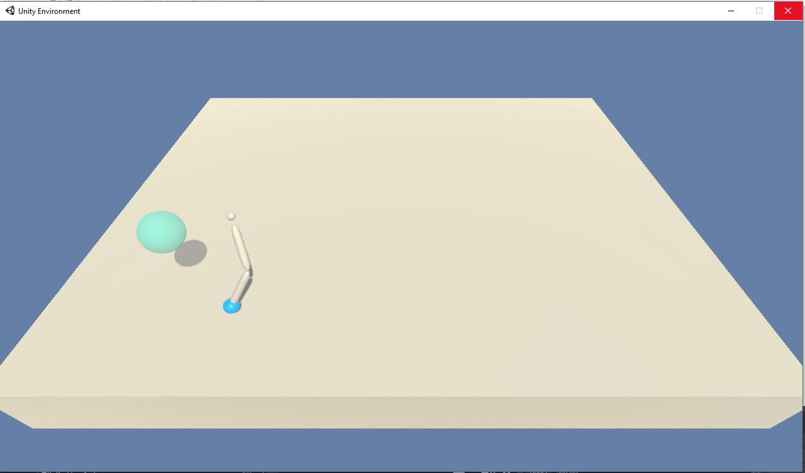
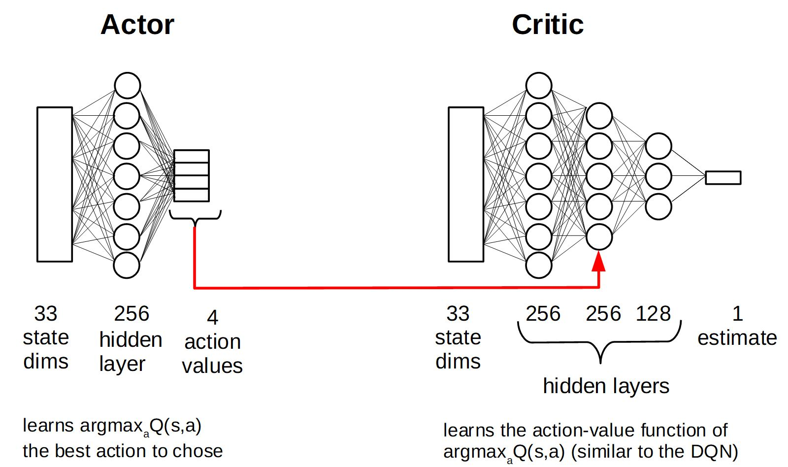
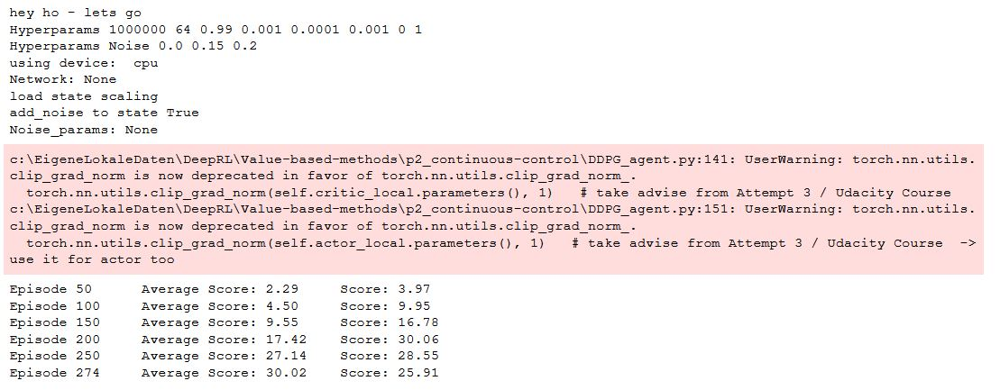

# Report
The report provides a description of the implementation to solve the Unity-ML [crawler project](https://github.com/Unity-Technologies/ml-agents/blob/main/docs/Learning-Environment-Examples.md#crawler) with DeepRL means. 
The Unit-ML Env. (Windows 64bit) can be downloaded [here].(https://s3-us-west-1.amazonaws.com/udacity-drlnd/P2/Crawler/Crawler_Windows_x86_64.zip)
 

## Preprocessing
A creature has 4 arms and 4 forearms to control. The observation space consists of 129 variables corresponding to position, rotation, velocity, and angular velocities of each limb plus the acceleration and angular acceleration of the body.
20 continuous actions, corresponding to target rotations for joints, are available to the agent. 
Most of the state features are not normalized. In fact, some feature values are in [-20,20] while others are in [-1,1] which can significantly decrease NN training performance.  
The state values are (optional) scaled by dividing with the elements of the scaling matrix: 
**Here** 
The matrix (int and float values) is stored in [state_scale_crawler.npz](state_scale_crawler.npz)

## DDPG (multi-agent env. / every nth step update of k epochs)
Training in the multi-agent (12) environment with the DDPG algorithm - updating the network weights at every nth step for k epochs. 

Different hyperparameter settings are tested (Max. Score = max of averaged_100 max scores):
| Run | Max. Score | Max. Episodes| Params|
--- | --- | ---| ---|
|1|44.14|3201|batchsize: 128, tau=0.001, discount_factor=0.99, clipping=1, UPDATE_EVERY_NTH_STEP= 30, UPDATE_MANY_EPOCHS = 20, LR_ACTOR 1e-4, LR_CRITIC = 1e-3, L2 weight decay (critic) = 0, NN-A 256; -C,256,256,128|
|2|28.51|243|batchsize: 128, tau=0.001, discount_factor=0.99, clipping=1, UPDATE_EVERY_NTH_STEP= 50, UPDATE_MANY_EPOCHS = 40, LR_ACTOR 1e-4, LR_CRITIC = 1e-3, L2 weight decay (critic) = 0, NN-A 256; -C,256,256,128|
|3|27.97|883|batchsize: 128, tau=0.001, discount_factor=0.99, clipping=1, UPDATE_EVERY_NTH_STEP= 50, UPDATE_MANY_EPOCHS = 40, LR_ACTOR 1e-4, LR_CRITIC = 1e-3, L2 weight decay (critic) = 0, NN-A 1024; -C,1024,512,256|
|4|25.17|701|batchsize: 512, tau=0.01, discount_factor=0.999, clipping=1, UPDATE_EVERY_NTH_STEP= 50, UPDATE_MANY_EPOCHS = 25, LR_ACTOR 5e-5, LR_CRITIC = 5e-5, L2 weight decay (critic) = 0, NN-A 1024; -C,1024,512,256|
|5|16.96|277|batchsize: 1024, tau=0.01, discount_factor=0.999, clipping=1, UPDATE_EVERY_NTH_STEP= 50, UPDATE_MANY_EPOCHS = 25, LR_ACTOR 5e-5, LR_CRITIC = 5e-5, L2 weight decay (critic) = 0, NN-A 1024,512,256; -C,1024,512,256|

## Learning Algorithm - DDPG 
I use the Deep Deterministic Policy Gradient (DDPG) in continous action space with fixed targets (soft update startegie), experience replay buffer and muti-agent environment to solve the assignment.  
 
 The DDPG requires two deep (or shallow and sufficently wide) neural neurworks. One named **actor**, learning a function approximation of the optimal deterministic policy \mu(s;\Theata_\mu), i.e. the best action a to take in a given states s: argmax_a Q(s,a). The other neural network is called **critic** and is used to approximate the action-value function Q for a given state s and the optimal action a determinied by policy \mu(s;\Theata_\mu), i.e. the action value function Q(s,\mu(s;\Theata_\mu));\Theta_Q). \Theta_\mu and \Theta_\Q indicate that the policy dependes on the network weights of the actor and the action-value function dependes on the network weights of the critic, respectively. 
 
 While the network uses and actor and a critic it is not directly an actor-critic (AC) approach and works more like an approximated DQN. The actor tries to predict the best action in a given state, the critic maximizes the Q values of the next state and is not used as a learned baseline (as in traditional AC approaches). 
 
 The two networks are depicted above. The optimal deterministic policy is approximated by the actor using a single fully connected (fc) hidden layer of 256. After the fc layer a ReLU activation function is applied and than its output is fc to the 4 dimensional output units. A tanh function is applied here to ensure that the action values are in the range [-1,1]. The action value function Q is approximated with 3 fc layers of 256, 256 and 128 units. Each followed by a ReLU activation function. The output of first layer is augmented with the action values determined by the policy (indicated by the red arrow in the picture above).  
The inpute space is 33 dimensional and each feature scaled to [-1,1]. The action space is 4 dimensional and continous, controlling the torque to the two joints of the robot arm. 
 
 
 The two networks (well in fact 4 networks: target and local network for each) are implemented in [Single/EveryStep](DDPG_Single_model_EveryStep.py), [Multiple/EveryStep](DDPG_Multi_model_EveryStep.py) and [Multiple/EverykthStep/nEpochs](DDPG_Multi_model_kthStep.py), respectively. They are augmented versions of the [base code](https://github.com/udacity/deep-reinforcement-learning/tree/master/ddpg-bipedal) from Udacity, namly the [LeakyReLU](https://paperswithcode.com/method/leaky-relu) activation functions are replaced by simple ReLU non-linearities.  
The DDPG agent code ([Single/EveryStep](DDPG_Single_agent_EveryStep.py), [Multiple/EveryStep](DDPG_Multi_agent_EveryStep.py) and [Multiple/EverykthStep/nEpochs](DDPG_Multi_agent_kthStep.py), respectivly) augments the provided [base code](https://github.com/udacity/deep-reinforcement-learning/tree/master/ddpg-bipedal) from Udacity. 
 The following adjustments are made: 
- interaction with single or multi-agent Unity-ML environment
- preprosessing of state values (scaling)
- augmenting the provided classes to allow hyperparameter and NN architecture changes on the fly, e.g. noise on/off
- a new parameter multiple_update_steps to update multiple times per agent.step() if positive and to only update with \epsilon=1/abs(multiple_update_steps) if negativ - alternatively (only 3rd approach) UPDATE_EVERY_NTH_STEP  and UPDATE_MANY_EPOCHS are introduced to controll k epoch updates after n steps
- gradients of the critic are clipped to prevent weight divergence torch.nn.utils.clip_grad_norm(self.critic_local.parameters(), 1) 
- gradients of the actor are clipped to prevent weight divergence torch.nn.utils.clip_grad_norm(self.actor_local.parameters(), 1) (only for 2nd approach) 
 
Implementations of fixed targets and experience replay buffer are unchanged compared to the code provided during the course. 
All learning hyperparameters are comparable or only slightly adjusted (highlighted by bold face) compared to the solution provided during the course, i.e.  
- n_episodes (int): maximum number of training episodes = 2000
- max_t (int): maximum number of timesteps per episode  = **1000-1**
- replay buffer size = int(1e6), BUFFER_SIZE
- minibatch size = **64**, BATCH_SIZE 
- discount factor, gamma = 0.99, GAMMA
- for soft update of target parameters, tau = 1e-3, TAU
- learning rate (actor) = 1e-4 (Adam optimizer), LR_ACTOR
- learning rate (critic) = **1e-3** (Adam optimizer), LR_CRITIC
- L2 weight decay (critic) = **0**, WEIGHT_DECAY
- how often to update the networks = 1, multiple_update_steps (only for 1st and 2nd approach)
- update every kth step= 30 , UPDATE_EVERY_NTH_STEP (only for 3rd approach)
- update how many epochs = 20 , UPDATE_MANY_EPOCHS  (only for 3rd approach)

  
## Plot of Rewards
2nd attempt needed 274 episodes     
All other attempts did not reach the goal in the given training time (see above). 
The agent can be tested using [ShowAgentPerformance.ipynb](ShowAgentPerformance.ipynb)
 
